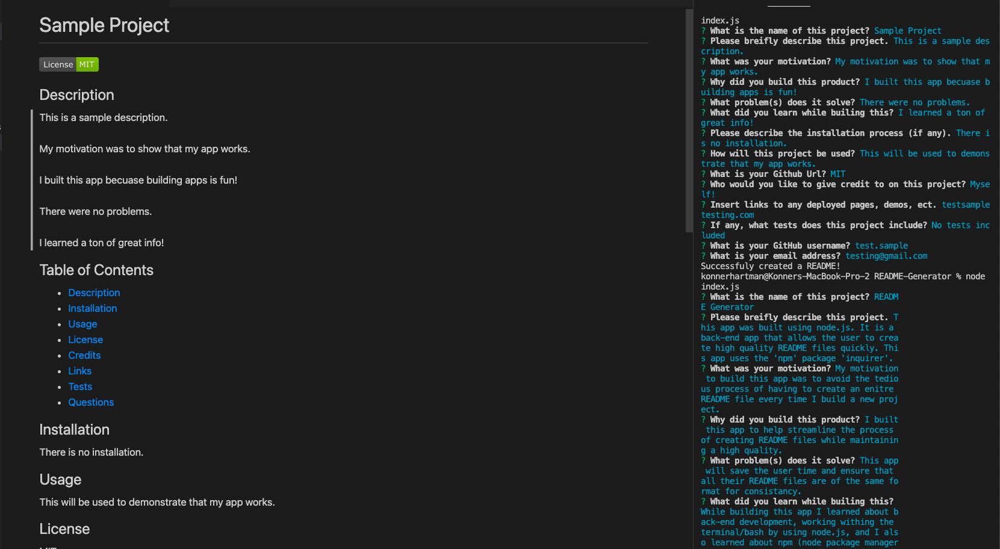

# README Generator
  
  
  ## Description
  This app was built using node.js. It is a back-end app that allows the user to create high quality README files quickly. This app uses the 'npm' package 'inquirer'.
   
   
  My motivation to build this app was to avoid the tedious process of having to create an enitre README file every time I build a new project.
   
   
  I built this app to help streamline the process of creating README files while maintaining a high quality.
   
   
  This app will save the user time and ensure that all their README files are of the same format for consistancy.
   
   
  While building this app I learned about back-end development, working withing the terminal/bash by using node.js, and I also learned about npm (node package manager).
  
  ## Table of Contents
  - [Description](#)
  - [Installation](#installation)
  - [Usage](#usage)
  - [License](#license)
  - [Credits](#credits)
  - [Links](#links)
  - [Screencaptures](#screencaptures)
  - [Tests](#tests)
  - [Questions](#questions)
  
  ## Installation
  To install this the user must navigate to the directory they are working in and in the command line call 'npm init', then 'npm i inquirer'.
  
  ## Usage
  This app will be used by users to optimize their time by cutting back on time spent writing a README file from scratch. This app will prompt the user with several questions and take that input and create a README file for them.
  
  ## License
  MIT
  
  ## Credits
  Konner Hartman (myself)
   
  https://shields.io/ (for the license badge)
   
  https://coding-boot-camp.github.io/full-stack/github/professional-readme-guide (documentation on professional READMEs)

  ## Links
  https://youtu.be/pIQF5OCFVFs (Demo Video)
   
  https://github.com/konnerhartman/README-Generator (GitHub Repo).
  
  ## Screencaptures
  Screenshot:
   
  
   
  Gif:
   
  

  ## Tests
  This does not include any tests.
  
  ## Questions
  Any questions can be directed to:
   
  Github: [konnerhartman](https://github.com/konnerhartman)
   
  Email: konner.hartman@yahoo.com
